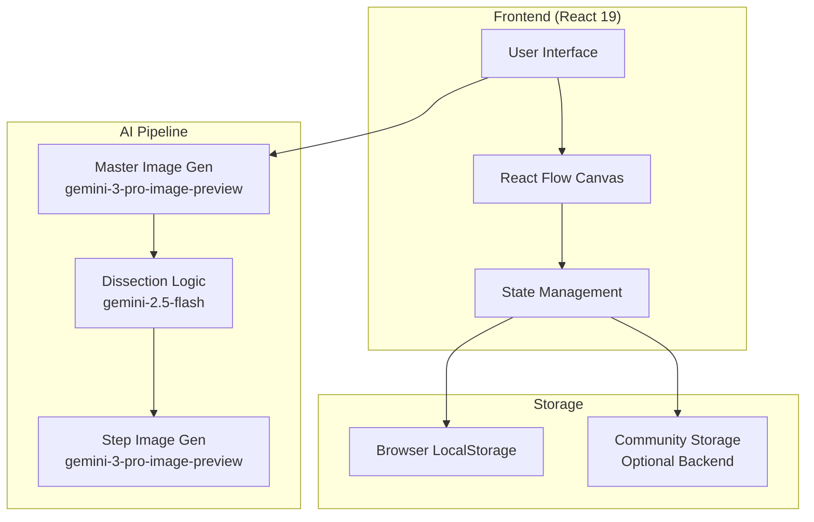

# Design Document

## Overview

Craftus is a React-based web application that combines an infinite canvas interface with Google's Gemini AI to create visual craft instruction sequences. The application follows a three-stage AI generation pipeline: Master Image creation, text-based dissection, and isolated step image generation. The architecture emphasizes minimal backend requirements, browser-based state management, and sequential AI request handling to manage rate limits.

## Architecture

### High-Level Architecture



### Technology Stack

- **Frontend Framework**: React 19 with functional components and hooks
- **Styling**: TailwindCSS with custom dark mode theme
- **Canvas**: React Flow (@xyflow/react) for infinite workspace
- **AI Integration**: Google GenAI SDK (@google/genai)
- **Icons**: Lucide React
- **Routing**: React Router v6
- **State Management**: React Context API + useReducer
- **Storage**: Browser LocalStorage (primary), optional Supabase for community features

### Design Principles

1. **AI-First Workflow**: All visual content generated through Gemini API
2. **Sequential Processing**: Queue step images to avoid rate limits
3. **Graceful Degradation**: Handle API failures with retry logic and fallback states
4. **Minimal Backend**: Use browser storage for MVP, optional cloud sync
5. **Spatial Interaction**: Leverage React Flow for intuitive node manipulation

## Components and Interfaces

### Core Components

#### 1. App Shell (`App.jsx`)

```typescript
interface AppProps {}

// Root component with routing and global providers
// Routes: /, /canvas, /projects, /community
```

**Responsibilities**:
- Route configuration
- Global context providers (AI, Projects, Theme)
- Error boundary wrapper

#### 2. Landing Page (`LandingPage.jsx`)

```typescript
interface LandingPageProps {}

// Sections: Hero, HowItWorks, Categories, Showcase, Footer
```

**Responsibilities**:
- Marketing content display
- Navigation to canvas
- Example project carousel

#### 3. Canvas Workspace (`CanvasWorkspace.jsx`)

```typescript
interface CanvasWorkspaceProps {
  projectId?: string;
  readOnly?: boolean;
}

interface CanvasNode {
  id: string;
  type: 'master' | 'materials' | 'step';
  position: { x: number; y: number };
  data: MasterData | MaterialsData | StepData;
}
```

**Responsibilities**:
- React Flow canvas initialization
- Node rendering and positioning
- Zoom/pan controls
- Chat interface integration

#### 4. Chat Interface (`ChatInterface.jsx`)

```typescript
interface ChatInterfaceProps {
  onSubmit: (prompt: string, category: CraftCategory) => Promise<void>;
}

interface ChatMessage {
  id: string;
  role: 'user' | 'assistant';
  content: string;
  timestamp: Date;
}
```

**Responsibilities**:
- Text input for craft descriptions
- Category selector dropdown
- Message history display
- Loading states during generation

#### 5. Node Components

##### Master Node (`MasterNode.jsx`)

```typescript
interface MasterNodeData {
  imageUrl: string;
  prompt: string;
  category: CraftCategory;
  status: 'generating' | 'ready' | 'error';
}

interface MasterNodeProps {
  data: MasterNodeData;
  onDissect: () => void;
}
```

**Responsibilities**:
- Display Master Reference Image
- Dissect button with loading state
- Error display and retry option

##### Materials Node (`MaterialsNode.jsx`)

```typescript
interface MaterialsNodeData {
  materials: string[];
  status: 'loading' | 'ready';
}

interface MaterialsNodeProps {
  data: MaterialsNodeData;
}
```

**Responsibilities**:
- Display materials list
- Visual grouping and formatting

##### Step Node (`StepNode.jsx`)

```typescript
interface StepNodeData {
  stepNumber: number;
  description: string;
  imageUrl?: string;
  status: 'pending' | 'generating' | 'ready' | 'error';
  requirements: string[];
}

interface StepNodeProps {
  data: StepNodeData;
  onRetry?: () => void;
}
```

**Responsibilities**:
- Display step number and description
- Show step image when generated
- Loading skeleton during generation
- Error state with retry button

#### 6. Projects Gallery (`ProjectsGallery.jsx`)

```typescript
interface Project {
  id: string;
  name: string;
  category: CraftCategory;
  masterImageUrl: string;
  lastModified: Date;
  canvasState: CanvasState;
}

interface ProjectsGalleryProps {}
```

**Responsibilities**:
- Grid layout of saved projects
- Project card actions (open, delete, duplicate)
- Search and filter by category

#### 7. Community Gallery (`CommunityGallery.jsx`)

```typescript
interface CommunityProject {
  id: string;
  masterImageUrl: string;
  category: CraftCategory;
  difficulty: number;
  creatorHandle: string;
  publishedAt: Date;
  canvasState: CanvasState;
}

interface CommunityGalleryProps {}
```

**Responsibilities**:
- Pinterest-style masonry grid
- Project preview cards
- Open in readonly mode
- Share functionality

### AI Service Layer

#### AI Service (`services/aiService.js`)

```typescript
interface AIService {
  generateMasterImage(prompt: string, category: CraftCategory): Promise<string>;
  dissectCraft(prompt: string, imageUrl: string): Promise<DissectionResult>;
  generateStepImage(
    stepDescription: string,
    category: CraftCategory,
    masterImageUrl: string
  ): Promise<string>;
}

interface DissectionResult {
  complexity: 'Simple' | 'Moderate' | 'Complex';
  complexityScore: number;
  materials: string[];
  steps: Step[];
}

interface Step {
  stepNumber: number;
  description: string;
  requirements: string[];
}
```

**Key Methods**:

1. **generateMasterImage**: Calls gemini-3-pro-image-preview with category-specific prompt
2. **dissectCraft**: Calls gemini-2.5-flash with structured JSON schema
3. **generateStepImage**: Calls gemini-3-pro-image-preview with category-specific knolling rules

**Error Handling**:
- Exponential backoff for 503 errors (1s, 2s, 4s delays)
- Maximum 3 retry attempts
- Rate limit detection and queuing

#### Request Queue (`services/requestQueue.js`)

```typescript
interface RequestQueue {
  enqueue(request: () => Promise<any>): Promise<any>;
  getQueueLength(): number;
}
```

**Responsibilities**:
- Sequential processing of step image requests
- Configurable delay between requests (default 2s)
- Promise-based queue management

### State Management

#### AI Context (`contexts/AIContext.jsx`)

```typescript
interface AIContextState {
  currentProject: Project | null;
  isGenerating: boolean;
  error: string | null;
}

interface AIContextActions {
  summonCraft: (prompt: string, category: CraftCategory) => Promise<void>;
  dissectCraft: (projectId: string) => Promise<void>;
  generateStepImages: (projectId: string) => Promise<void>;
  clearError: () => void;
}
```

#### Projects Context (`contexts/ProjectsContext.jsx`)

```typescript
interface ProjectsContextState {
  projects: Project[];
  currentProjectId: string | null;
}

interface ProjectsContextActions {
  saveProject: (project: Project) => void;
  loadProject: (projectId: string) => void;
  deleteProject: (projectId: string) => void;
  duplicateProject: (projectId: string) => void;
  publishToCommunity: (projectId: string) => Promise<void>;
}
```

## Data Models

### Project Model

```typescript
interface Project {
  id: string; // UUID
  name: string; // Auto-generated or user-edited
  category: CraftCategory;
  prompt: string;
  masterImageUrl: string;
  dissection: DissectionResult | null;
  stepImages: Map<number, string>; // stepNumber -> imageUrl
  canvasState: CanvasState;
  createdAt: Date;
  lastModified: Date;
}
```

### Canvas State Model

```typescript
interface CanvasState {
  nodes: CanvasNode[];
  edges: CanvasEdge[];
  viewport: {
    x: number;
    y: number;
    zoom: number;
  };
}
```

### Craft Category Enum

```typescript
type CraftCategory =
  | 'Papercraft'
  | 'Clay'
  | 'Fabric/Sewing'
  | 'Costume & Props'
  | 'Woodcraft'
  | 'Jewelry'
  | 'Kids Crafts'
  | 'Tabletop Figures';
```

## AI Prompt Engineering

### Master Image Prompt Template

```
Create a photorealistic studio photograph of a DIY craft project: {user_prompt}.
Category: {category}.
Style: Neutral background, even studio lighting, highly detailed textures showing materials such as fabric weave, paper fibers, clay surface, foam texture, wood grain, or beads.
The object should look handmade and fully finished.
Center the object.
Do not include tools, hands, or environment.
```

### Dissection Prompt Template

```
You are an expert maker. Analyze this craft project described as "{user_prompt}".

1. Determine the complexity (Simple, Moderate, Complex) and a score from 1-10.
2. List all essential materials visible or implied.
3. Break down the construction into clear chronological steps.

Return strict JSON matching this schema:
{
  "complexity": "Simple" | "Moderate" | "Complex",
  "complexityScore": number,
  "materials": string[],
  "steps": [
    {
      "stepNumber": number,
      "description": string,
      "requirements": string[]
    }
  ]
}
```

### Step Image Prompt Template (Category-Specific)

Each category has specific visual rules. Example for Papercraft:

```
REFERENCE IMAGE: This is the finished papercraft model.
TASK: Generate a photorealistic step image for: "{step_description}".

STRICT VISUAL RULES:
1. EXTREME ISOLATION: Show ONLY the paper pieces, flat cut shapes, folded tabs, scored lines, or glue flaps needed for this step.
2. EXCLUDE UNRELATED PARTS: Do NOT show the full model or other pieces.
3. VIEW: Knolling flat-lay OR macro close-up for folds/tab placement.
4. CONSISTENCY: Match paper texture, weight, color, and edge sharpness from the Reference Image.
5. BACKGROUND: Pure white, evenly lit.
```

Similar templates exist for all 8 categories with category-specific material and technique details.

## Error Handling

### Error Types and Responses

1. **API Overload (503)**
   - Retry with exponential backoff: 1s, 2s, 4s
   - Max 3 attempts
   - Display "Service temporarily busy, retrying..." message

2. **Rate Limit Exceeded**
   - Queue remaining requests
   - Process sequentially with 2s delay
   - Display "Generating step X of Y..." progress

3. **Invalid Response**
   - Log error details
   - Display "Generation failed" with retry button
   - Preserve user's prompt and category selection

4. **Network Failure**
   - Display "Connection lost" message
   - Provide manual retry button
   - Cache partial progress

### Error UI States

```typescript
interface ErrorState {
  type: 'api_error' | 'rate_limit' | 'network' | 'invalid_response';
  message: string;
  retryable: boolean;
  retryCount: number;
}
```

## Testing Strategy

### Unit Tests

**Priority Components**:
- AI Service (mock Gemini API responses)
- Request Queue (sequential processing logic)
- Project storage (LocalStorage operations)
- Prompt template generation

**Testing Framework**: Vitest + React Testing Library

### Integration Tests

**Key Flows**:
1. Complete craft generation flow (summon → dissect → step images)
2. Project save and load
3. Error handling and retry logic
4. Canvas node positioning and interaction

### Manual Testing Checklist

- [ ] Test all 8 craft categories with diverse prompts
- [ ] Verify step images show proper isolation
- [ ] Confirm material texture consistency
- [ ] Test error recovery scenarios
- [ ] Validate responsive layouts on mobile/tablet/desktop
- [ ] Test canvas performance with 20+ nodes
- [ ] Verify LocalStorage limits (5-10MB typical)

## Performance Considerations

### Image Optimization

- Use WebP format for generated images when possible
- Implement lazy loading for step images
- Cache generated images in browser
- Consider image compression for storage

### Canvas Performance

- Limit visible nodes using React Flow's viewport culling
- Debounce node position updates
- Use React.memo for node components
- Implement virtual scrolling for large projects

### API Rate Limiting

- Queue step image generation (max 1 request per 2 seconds)
- Implement request cancellation for abandoned projects
- Cache API responses to avoid redundant calls
- Monitor quota usage and display warnings

## Security Considerations

- Sanitize user input before sending to AI
- Validate AI responses against expected schema
- Implement content moderation for community posts
- Use HTTPS for all API communications
- Store API keys in environment variables
- Implement CORS policies for community backend

## Deployment Architecture

### Frontend Hosting

- **Platform**: Vercel or Netlify
- **Build**: Vite production build
- **Environment Variables**: VITE_GEMINI_API_KEY

### Optional Backend (Community Features)

- **Platform**: Supabase or Firebase
- **Database**: PostgreSQL for community projects
- **Storage**: Cloud storage for images
- **Authentication**: Optional user accounts

### CI/CD Pipeline

1. GitHub Actions on push to main
2. Run tests (unit + integration)
3. Build production bundle
4. Deploy to hosting platform
5. Run smoke tests on deployed URL

## Future Enhancements

1. **Export Features**: PDF generation of instruction booklets
2. **Collaboration**: Share projects with edit permissions
3. **AI Refinement**: Allow users to regenerate specific step images
4. **Templates**: Pre-built project templates for common crafts
5. **Print Optimization**: High-resolution export for physical printing
6. **Mobile App**: Native iOS/Android with offline support
7. **Video Instructions**: Generate time-lapse assembly videos
8. **Material Shopping**: Link materials to online retailers
